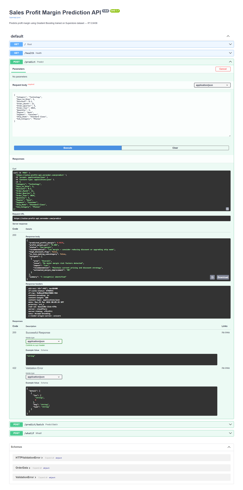

# 🛒 Retail Sales Revenue Prediction

End-to-end retail analytics project combining order-level regression, time series forecasting, and SQL analytics on Superstore data. Uses XGBoost Regressor for order-level prediction, Facebook Prophet for 90-day revenue forecasting, ARIMA for statistical decomposition, and LSTM for deep learning forecasting — all compared side by side.

## Live Deployments
| | URL |
|--|--|
| REST API | https://sales-profit-api.onrender.com |
| API Docs | https://sales-profit-api.onrender.com/docs |

## Screenshots



## 🔍 What Makes This Unique
- **Three-Layer Forecasting** — XGBoost (order level) + Prophet (90-day) + ARIMA (decomposition) + LSTM (deep learning) — four approaches compared on same dataset
- **SQL Analytics** — 19 SQL queries covering Basic → Advanced Window Functions, RFM segmentation, CLV, Pareto analysis, MoM/YoY growth
- **Pareto Analysis** — identifies which 20% of sub-categories drive 80% of revenue with running cumulative window
- **What-If Discount Analysis** — shows optimal discount level for maximum predicted revenue
- **Seasonality Decomposition** — trend + seasonality + residual breakdown via ARIMA and Prophet components
- **RFM Segmentation** — fully written in SQL using NTILE window function
- **Business Insights** — automated recommendations from SQL results including loss-making products and discount impact

## 📊 Dataset
Superstore Sales — 9,994 orders × 21 columns
Sales · Profit · Discount · Quantity · Category · Region · Segment

## Tech Stack
Python · Gradient Boosting · Prophet · ARIMA · LSTM · SHAP · FastAPI · Docker · SQLite · Render

## What's Inside
- 4-model comparison: Linear, Ridge, Random Forest, Gradient Boosting
- Feature engineering: Discount_x_Quantity, High_Discount, Is_Q4
- ARIMA + LSTM time series forecasting
- 19 advanced SQL queries: RFM, CLV, Pareto 80/20, MoM/YoY growth
- What-If discount analysis

## Unique API Feature — /whatif Endpoint
Send an order and instantly compare profit margin at different discount levels:
```json
{
  "current_discount": "20%",  "current_margin": "8.38%",
  "reduce_10pct_discount": { "margin": "13.36%", "improvement": "4.98pp" },
  "zero_discount": { "margin": "24.82%", "improvement": "16.44pp" }
}
```

## Related
- API repo: [Sales-Profit-API](https://github.com/KV0217/Sales-Profit-API)

## 📈 Regression Results
| Model | Metric |
|-------|--------|
| Linear Regression | Baseline |
| Ridge Regression | Regularized |
| Random Forest | ~R² 0.XX |
| Gradient Boosting | ~R² 0.XX |
| **XGBoost (Tuned)** | **Best R²** |

## 🗄️ SQL Highlights
```sql
-- RFM Segmentation (NTILE + 3-level CTE)
WITH rfm AS (
    SELECT Customer_ID, MAX(Order_Date) AS last_order,
           COUNT(DISTINCT Order_ID) AS frequency,
           ROUND(SUM(Sales),0) AS monetary
    FROM superstore GROUP BY Customer_ID
),
scored AS (
    SELECT *,
        NTILE(5) OVER (ORDER BY last_order DESC) AS recency_score,
        NTILE(5) OVER (ORDER BY frequency DESC)   AS frequency_score,
        NTILE(5) OVER (ORDER BY monetary DESC)    AS monetary_score
    FROM rfm
)
SELECT CASE WHEN recency_score>=4 AND frequency_score>=4
             AND monetary_score>=4 THEN '🏆 Champions'
            WHEN recency_score<=2 AND frequency_score<=2
            THEN '😴 At Risk' ELSE '📦 Regular' END AS rfm_segment,
       COUNT(*) AS customers
FROM scored GROUP BY rfm_segment
```

## 🔑 Key Insights
- Heavy discounting (40%+) results in negative profit margins
- Technology category drives highest average order value
- Q4 (Nov-Dec) is consistently the peak revenue quarter
- West region has highest total revenue
- 3-4 sub-categories drive ~80% of total revenue (Pareto)

## 💡 Forecasting Comparison
| Model | Type | Best For |
|-------|------|----------|
| XGBoost | Regression | Order-level prediction |
| Prophet | Time Series | Long-term trend + seasonality |
| ARIMA | Statistical | Short-term + decomposition |
| LSTM | Deep Learning | Complex sequential patterns |

## 👤 Author
**KAVIN VENKAT**
[LinkedIn](www.linkedin.com/in/kavin-venkat-1710s0202) 
